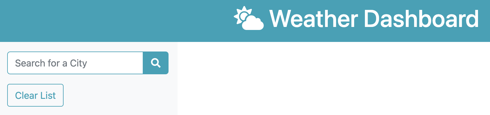
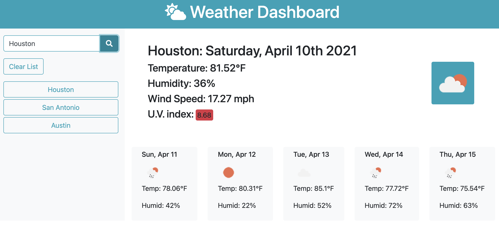
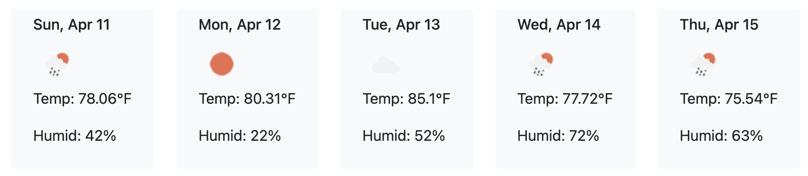
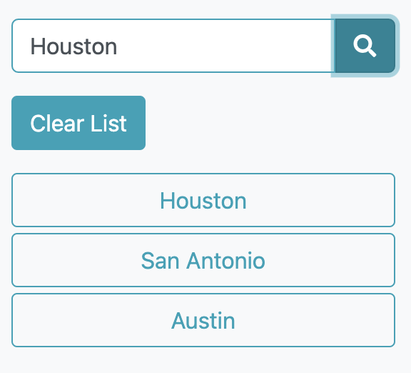

# Weather Dashboard

## Links
Live Site: https://witnessmyhands.github.io/Weather-Dashboard/
Repository: https://github.com/WitnessMyHands/Weather-Dashboard

## Site Introduction

The weather dashboard utilizes OpenWeather API to pull weather forecasts for user indicated Cities. The following features can be found from this single-page site:
* Search Field
* History Tracking with Interactive Buttons
* Clear History Button
* Weather API displaying Featured Day and 5-Day Forecast
* Icons
* Hover Elements

## Weather API

The interface is simple with a left-justified search box enabling users to "Search for a City". This feature pulls from the OpenWeather API displaying real time Location, Time, Temperature, Humidity, Wind Speed and U.V. Index, in addition to the color coordinated icon imagery of the weather over an entire row.

The five day forecast is displayed below the "featured" city and day under a light-colored background with pertinent daily information.

A clear button was added for user convenience to maintain cleanliness of the site, enabling users to delete previous entries.

